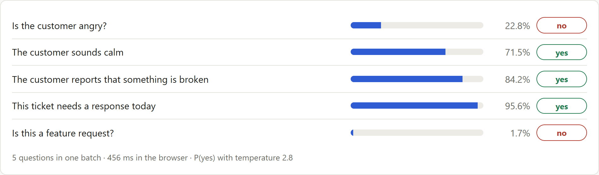
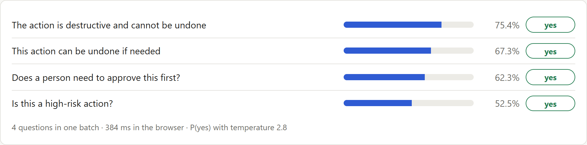
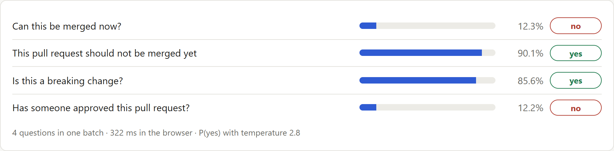
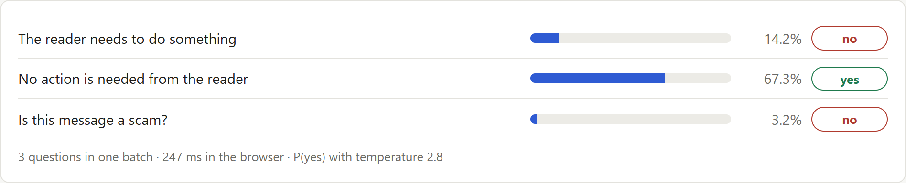

# Maya: A Yes/No AI Guardrail Model That Runs in the Browser

**TL;DR:** Maya is an open **yes/no classifier**. You give it a text and a statement ("this change can be undone", "is the customer angry?") and it returns the probability that the answer is yes. It belongs to the same family as the decision models **Jev** and **Laya**, is built on an **NLI encoder**, and does a job close to that of **LLM guard** models. It differs from each of them in specific ways, covered below.

This article covers the whole project: the background, the first version that passed its benchmarks and then failed its own demo, the fix, the results and what is still wrong.

Accuracy on three hand-labeled test sets that were never used for training:

| Test set | Laya | Best zero-shot NLI model | Maya v0.1 | **Maya v0.2** |
|---|---|---|---|---|
| Judgment questions, written before the v0.2 training data (192 answers) | 62.5% | 72.9% | 71.9% | **87.5%** |
| Eight unseen domains (256 answers) | 80.1% | 89.8% | 81.2% | **95.3%** |
| Familiar domains (120 answers) | 68.3% | 75.8% | 78.3% | **87.5%** |

Maya v0.2 is still wrong about one time in eight on judgment questions.

- **Try it in your browser: [vishalmysore.github.io/maya](https://vishalmysore.github.io/maya/)**
- Code, data, tests and every result: [github.com/vishalmysore/maya](https://github.com/vishalmysore/maya)
- Model weights: [huggingface.co/VishalMysore/maya](https://huggingface.co/VishalMysore/maya)
- Browser build: [huggingface.co/VishalMysore/mayaWasm](https://huggingface.co/VishalMysore/mayaWasm)


## Contents

1. [What is Jev?](#what-is-jev)
2. [What is Laya?](#what-is-laya)
3. [What is Maya?](#what-is-maya)
4. [What are NLI encoders?](#what-are-nli-encoders)
5. [What are LLM guards?](#what-are-llm-guards)
6. [How is Maya different?](#how-is-maya-different)
7. [How Maya works](#how-maya-works)
8. [The test sets](#the-test-sets)
9. [Maya v0.1: good benchmarks, wrong answers](#maya-v01-good-benchmarks-wrong-answers)
10. [Diagnosis: template overfitting and literal reading](#diagnosis-template-overfitting-and-literal-reading)
11. [Maya v0.2: the fix](#maya-v02-the-fix)
12. [Results](#results)
13. [Choosing the model without peeking](#choosing-the-model-without-peeking)
14. [What did not work](#what-did-not-work)
15. [Where Maya v0.2 is still wrong](#where-maya-v02-is-still-wrong)
16. [Running Maya in the browser](#running-maya-in-the-browser)
17. [Testing](#testing)
18. [Lessons learned](#lessons-learned)
19. [FAQ](#faq)

## What is Jev?

Jev is a hosted **decision model** from TypeSafe AI, launched in September 2026. TypeSafe calls it a "System One" model, after Daniel Kahneman's term for fast, intuitive judgment.

**What it does.** Jev never writes text. You send it a *state* (any text or structured data) and one or more *typed questions*, and it returns one typed answer per question, each with a probability:

| Question type | What it answers | What comes back |
|---|---|---|
| **Choice** | Pick one label from a list | a probability per option |
| **Score** | Place the text on an ordered scale | a probability per level |
| **Noul** | A yes/no condition | one probability that it is true |

**Why people use it.** An LLM answers "route this ticket" by writing text that your code then has to parse and validate. A decision model returns a value inside the schema you defined, in one pass, with a confidence your code can act on: do it automatically above a threshold, send it to a person below.

**What it is not.** Jev's weights are closed and it is reached through an API. It was not benchmarked in this project. Everything here that concerns Jev is its public description, not a measurement.

## What is Laya?

[Laya](https://huggingface.co/convaiinnovations/laya-typed-decisions) is an **open** decision model from ConvAI Innovations that follows the same design: a state plus typed questions (choice, score, yes/no) in, probabilities out.

- **Architecture:** a ModernBERT-large encoder (395M parameters) with a small decision head (26.5M), 421M in total.
- **Why it matters here:** because the weights are open, Laya can be measured, taken apart and run in a browser. It is the main decision-model baseline in this article.
- **layaMOE:** an earlier project of mine, [layaMOE](https://github.com/vishalmysore/layaMOE), adds domain-expert heads and a router on top of Laya's frozen encoder. It also appears as a baseline.

Laya answers all three question types from one encoder pass. On yes/no questions, the subject of this article, it scores 62-80% on the test sets below.

## What is Maya?

Maya takes one of those three question types, **yes/no**, and gives it a dedicated model.

- **Input:** a text and a statement, or a yes/no question.
- **Output:** P(yes), and from it the answer "yes" or "no". If you set an abstention band, a third answer, "not sure", appears between two thresholds.
- **Current version:** v0.2, a 435M-parameter fine-tune of DeBERTa-v3-large-zeroshot-v2.0. It runs in Python on a CPU, and as a 600 MB int8 ONNX model in the browser.
- **Open:** code, data, tests, results and weights are public.

The reasoning behind a dedicated model: yes/no is the question type that guardrails and early-exit filters use most; a single probability is the easiest output to calibrate; and "X" and "not X" should never both be true, which can be tested and trained for.

## What are NLI encoders?

**Natural language inference (NLI)** is the task of deciding whether one sentence follows from another. Given a *premise* ("The parcel arrived smashed") and a *hypothesis* ("The item was damaged"), an NLI model labels the pair as entailment, contradiction or neutral.

- **Encoders.** NLI models are usually encoders such as BERT, DeBERTa or ModernBERT. They read text and produce a classification; they do not generate text.
- **Cross-encoders.** The premise and hypothesis go through the model together as one sequence, so every word of one can attend to every word of the other. This is accurate, but it costs one model pass per pair.
- **Zero-shot classification.** An NLI model can answer questions it was never trained on: put the text in as the premise and your statement in as the hypothesis, and read the entailment probability as "yes". Models such as the `zeroshot-v2.0` DeBERTa family are fine-tuned on many datasets for exactly this.

**Their limit.** An NLI model asks whether the text *literally supports* the statement. That works for facts ("pets are allowed"). It breaks on judgment ("the customer is angry", "a person should approve this"), which a text rarely states outright. The results below show the consequence: zero-shot NLI models say "no" to both a statement and its negation most of the time.

Maya is built on an NLI encoder and keeps its strength on facts, then adds the judgment reading through fine-tuning.

## What are LLM guards?

**LLM guards** are models that sit next to a large language model and check what goes in or comes out. Well-known examples are Llama Guard and Prompt Guard from Meta and ShieldGemma from Google.

- **What they check.** Mostly a fixed list of safety categories: violence, hate, self-harm, sexual content, and for Prompt Guard, prompt injection and jailbreak attempts.
- **How they are built.** Some are LLMs fine-tuned to output "safe" or "unsafe" plus a category. Others are small encoder classifiers with a fixed set of labels.
- **What they are good at.** Content safety against a published policy, at scale.

**Their limit for this job.** A guard answers the questions it was trained for. It does not answer "can this database change be undone?", "does this invoice match the quote?" or "is this customer about to cancel?". Those are application-specific yes/no questions, and they are the ones Maya is for.

## How is Maya different?

| | Jev | Laya | Zero-shot NLI encoder | LLM guard | **Maya** |
|---|---|---|---|---|---|
| Weights | closed, API | open | open | mostly open | open |
| Question types | choice, score, yes/no | choice, score, yes/no | any statement | fixed safety categories | **yes/no only**, any statement |
| Reads judgment ("is this risky?") | by design | by design | weak, reads literally | only its own categories | **trained for it** |
| Generates text | no | no | no | some do | no |
| Runs in a browser tab | no | yes | yes | small ones | yes |
| Tested here | no | yes | yes | no | yes |

In practice:

- **Versus Jev and Laya:** the same idea of typed decisions without text generation, narrowed to yes/no. Maya gives up choice and score questions. In return it is more accurate on yes/no than Laya on every test set here, and far more consistent.
- **Versus zero-shot NLI:** the same kind of model, and v0.2 starts from one. The difference is judgment. On judgment questions, fine-tuning lifts the same DeBERTa model from 72.9% to 87.5%, and cuts self-contradictions from 73% to 12%.
- **Versus LLM guards:** open statements, not a fixed list. You write the question at request time.

**What is not unique about Maya.** It is a fine-tuned NLI cross-encoder. The techniques it uses (rule-labeled synthetic data, minimal pairs, word-overlap traps) are known methods. The parts of this project that are less common are:
- test sets in which every case carries a negation, an implication, a minimal-pair partner and traps;
- self-consistency reported as a headline number;
- a full account of a model that passed its benchmarks and failed in use.

## How Maya works

Maya is a **cross-encoder**. The text and the statement go through the model together, `[CLS] text [SEP] statement [SEP]`, and the classifier head produces two logits:

```
P(yes) = sigmoid((logit_yes - logit_no) / temperature)
```

**It can only answer yes or no.** There is no text generator, so it cannot ramble or produce a third label by accident. The flip side is that it cannot refuse: a question that is not yes/no ("what colour is it?") still gets a probability, so only ask yes/no questions.

Statements can be claims ("The customer sounds angry") or questions ("Is the customer angry?").

```python
from maya.gate import Maya

maya = Maya.load("VishalMysore/maya")
maya.ask("Agent plan: delete the `sessions` table on the production database. A verified backup was "
         "taken ten minutes ago and the on-call engineer has reviewed the plan.",
         ["The action is destructive and cannot be undone", "This action can be undone if needed"])
# no (0.15), yes (0.90)
```


## The test sets

Accuracy alone flatters yes/no models: on the first test set, answering "no" to everything scores 62.5%. So every model is measured on three hand-labeled sets and on more than accuracy.

| Set | Answers | What it is |
|---|---|---|
| **v1** | 120 | 8 domains from the earlier layaMOE project; mostly kinds of text Maya trains on |
| **v2** | 256 | 8 domains never used in training: rental listings, travel notices, school messages, contract clauses, scam messages, smart-home commands, recipes, job postings |
| **v3** | 192 | judgment questions in 8 domains, written and committed **before** the v0.2 training data; 6 of the domains never appear in training |
| dev | 64 | same domains as v3, different cases; used only to choose the checkpoint and fit the temperature |

Every v2 and v3 case has built-in checks:

| Check | Example | What a good model does |
|---|---|---|
| Negation pair | "The traveler needs to take action" / "The traveler does not need to do anything" | gives opposite answers |
| Implication pair | "Dogs are allowed" => "Pets are allowed" | never says yes to the first and no to the second |
| Minimal pair | the same recipe with "crushed peanuts" or "toasted sesame seeds" | flips the answer to "safe for a peanut allergy" |
| Word-overlap trap (v3) | "I'm not angry, just curious: is there a keyboard shortcut?" | is not fooled by the word "angry" |

## Maya v0.1: good benchmarks, wrong answers

**How v0.1 was built**
- **Base:** ModernBERT-base-zeroshot-v2.0, 150M parameters. With no training at all, it already matched layaMOE on ranking quality.
- **Data:** 4,463 rule-labeled texts with 20,429 statements across 12 domains. Every fact had plain and negated wordings, and about half of the slot-based texts had a minimal-pair partner.
- **Training:** one epoch on a laptop CPU, about 80 minutes, with a consistency loss.

**How it scored**
- 78.3% on v1, tied with layaMOE and ten points above plain Laya.
- 81.2% on v2, level with Laya.
- It contradicted itself on only 25-27% of negation pairs, where every other model was at 44-100%.
- The int8 browser build was 161 MB.

**Then we tried the demo.**



| Text | Question | Correct | Maya v0.1 |
|---|---|---|---|
| "STILL BROKEN. Third time the export fails. I'm paying for this. Fix it or I cancel." | Is the customer angry? | yes | **no** (0.23) |
| Same ticket | The customer sounds calm | no | **yes** (0.72) |
| "Delete the sessions table on production. A verified backup was taken ten minutes ago." | The action is destructive and cannot be undone | no | **yes** (0.75) |
| "Run DELETE on production. No backup, and no human has reviewed this." | It is safe to run without a human approving it | no | **yes** (0.92) |
| A real phishing text asking for a bank code | This message is a scam | yes | **no** (0.00) |



## Diagnosis: template overfitting and literal reading

Three experiments explained the failures.

**1. v0.1 had learned phrases, not concepts.** The angry ticket scored 0.23 for "angry". The same complaint with the word "Unacceptable" or "furious" scored above 0.90. Those were the words the training generator used for anger.

**2. Rare cases lost to common shortcuts.** In the backup example, v0.1 did notice the backup for one statement: "can be undone" moved from 0.04 to 0.89. But "destructive" stayed at 0.84-0.96 for any delete on production. Only 22 of the 20,429 training statements covered a destructive action with a backup, so thousands of other examples taught "delete on production means destructive".

**3. Zero-shot NLI models fail the opposite way.** The same examples went through untouched NLI models, and they said "no" to almost everything. "The customer is angry" is not literally stated, so the answer is no, and so is the answer to "the customer is calm".

So v0.1 made judgments, but from keywords. The fix had to teach judgment from data that keywords could not solve.

## Maya v0.2: the fix

### Step 1: write the test before the fix

The v1 and v2 errors had now been studied closely, so those sets could no longer give a clean verdict. Before writing any new training data, we wrote and committed the v3 test set and the dev set described above.

The existing models found v3 hard: Laya 62.5%, zero-shot DeBERTa-v3-large 72.9%, Maya v0.1 71.9%. No model got more than 38% of the minimal pairs fully right.

### Step 2: rebuild the training data

The labels still come from rules, so they are correct by construction. What changed is the text.

**Agent actions**
- Many openers, actions and scopes.
- Safety nets written a dozen ways ("a snapshot was made", "we can restore from the hourly dump", "it is a soft delete"), present in about two thirds of destructive plans.
- Negated safety nets too: "the backup job has been failing for a week".

**Customer messages**
- Anger through capitals, sarcasm ("Brilliant work, truly"), polite-but-firm wording, and blunt or weary styles.
- Calm messages that still report a problem, so "problem" does not mean "angry".
- Six contexts, from software to gym memberships.

**Traps and pairs**
- Texts that reuse a statement's words with the opposite meaning: "No human has checked this step" and "No approval is needed for this under the runbook".
- About 40% of the new texts have a minimal-pair partner that differs only in the deciding detail: the safety net, the review, the scope or the mood.

**Anchors**
- Real yes/no questions from BoolQ and NLI pairs from MNLI are mixed into every training step, so the model keeps its general reading skill.

The result is 5,687 texts and 25,717 statements, half of them "yes".

**Leakage guards.** Unit tests check both rules:
- No training text shares a five-word sequence with any test or dev text.
- No training statement equals a v2, v3 or dev statement.

### Step 3: a stronger base model

In the v0.1 evaluation, untouched **DeBERTa-v3-large-zeroshot-v2.0** was the best model on unseen domains (89.8%), so v0.2 starts from it.

Two candidates were fine-tuned on a laptop CPU, both with checkpoint selection on the dev set:
- **DeBERTa-v3-base:** one epoch, about 2 hours.
- **DeBERTa-v3-large:** 468 steps, about 2.5 hours, with frozen embeddings.

One practical note: load these models in float32 on CPU. The bfloat16 default made training about 100 times slower until a profiler run found it.

## Results


| Model | Params | v3: judgment | v2: unseen domains | v1: familiar |
|---|---|---|---|---|
| always "no" | | 43.2% | 50.8% | 62.5% |
| laya-typed-decisions | 421M | 62.5% | 80.1% | 68.3% |
| layaMOE | 421M + heads | 63.5% | 78.5% | 78.3% |
| ModernBERT-base zero-shot | 150M | 66.7% | 78.5% | 76.7% |
| DeBERTa-v3-base zero-shot | 184M | 66.7% | 81.2% | 70.8% |
| DeBERTa-v3-large zero-shot (v0.2's starting point) | 435M | 72.9% | 89.8% | 75.8% |
| Maya v0.1 | 150M | 71.9% | 81.2% | 78.3% |
| **Maya v0.2** | 435M | **87.5%** | **95.3%** | **87.5%** |

Fine-tuning added 14.6 points on judgment questions and 5.5 points on unseen domains over the same model used zero-shot. On v2, v0.2 now beats the off-the-shelf model that v0.1 lost to.

**Consistency.** Maya v0.2 gives the same answer to a statement and its negation on 12% of v3 pairs and 8% of v2 pairs. The zero-shot starting point does so on 73% and 30%.


**Minimal pairs.** Both texts of a pair are right 71% of the time on v3 (best earlier model: 38%) and 91% on v2 (best earlier: 78%).


**Traps.** On the 10 word-overlap trap cases, 90% of v0.2's answers are right.

**Calibration.** With one temperature (1.65) fitted on the dev set, calibration error is 0.064 on v3 and 0.025 on v2.

**The demo failures.** The examples that v0.1 got wrong now come out right:


More examples from the demo, all answered correctly:


## Choosing the model without peeking

There were three v0.2 candidates, and the choice was made on the dev set:

| Candidate | Dev (64 answers) | v3 | v2 | v1 |
|---|---|---|---|---|
| DeBERTa-v3-base fine-tune (184M) | 78.1% | 83.3% | 87.1% | 91.7% |
| **DeBERTa-v3-large fine-tune (435M), shipped** | **87.5%** | 87.5% | 95.3% | 87.5% |
| Ensemble of both | 85.9% | 88.5% | 93.0% | 93.3% |

The large model won on dev by one answer. Across all three test sets the ensemble is 3 answers better out of 568, which is a tie. The single model was shipped.

## What did not work

Three ideas from the original plan did not hold up.

**1. The consistency loss.** v0.1 trained with an extra loss that penalized a statement and its negation getting the same answer. A second model trained without it was just as consistent:

| | v1 accuracy | v2 accuracy | Contradictions v1 / v2 |
|---|---|---|---|
| v0.1 with the consistency loss | 78.3% | 81.2% | 25% / 27% |
| v0.1 without it | 80.8% | 79.7% | 25% / 25% |

The consistency comes from the data: training on both polarities of every fact, with opposite labels.

**2. Asking each question both ways.** Combining a statement with its negation, p = (p(X) + 1 - p(not X)) / 2, helped the zero-shot models. It made v0.2 worse on dev, so it is not used.

**3. Abstention with an error guarantee.** Maya's `conformal` module fits two thresholds so that, among the questions it answers, the error stays under a target with high probability. The code works, but:
- Calibrating on synthetic data does not transfer. v0.1 looked 97% right on synthetic data, the thresholds collapsed to 0.5, and real error was about 20%.
- The hand-labeled sets are too small. Neither 120 answers nor 64 could certify a useful bound for any model.

So Maya ships with strict yes/no. The demo's sliders set a "not sure" band by hand, without a guarantee. A real one needs a few hundred labeled examples of your own inputs.


Not built at all: answering many questions from **one encoder pass**. Maya still costs one pass per question.

## Where Maya v0.2 is still wrong

The demo found v0.1's failures, so we looked for v0.2's the same way.

**Code changes got worse.** For a pull request that drops a database column and has not been reviewed, v0.2 says it can be merged and is not a breaking change. Both are wrong.


v0.1 got this example right:



The v0.2 training mix has only 90 code-change texts, because the budget went to agent actions and tone. The smaller base candidate handles this example, and that is part of why the ensemble is steadier on familiar domains.

**One v0.1 failure is only half fixed.** For the production `DELETE` that "no human has reviewed", v0.2 correctly says it is not safe to run without a human. It still answers "no" to "A human should approve this action before it runs".


**A debatable one.** For a library pickup notice, v0.2 says the reader does not need to do anything, although the book has to be collected.



**Weaker domains**
- IT incidents (67%) and patient messages (75%) on v1.
- Smart-home commands (81%) on v2.
- Access requests, account security and leave requests (75-79%) on v3.

**Overall**
- About one in eight judgment answers is wrong (24 of 192 on v3).
- The test sets are small. One answer on v3 is half a point, and differences under about 5 points are not reliable.

**Do not use Maya as the only safety check.**

## Running Maya in the browser

**The build**
- One ONNX graph with **int8 weight-only quantization**, about 600 MB, split into 24 MiB parts with SHA-256 hashes.
- Checked against PyTorch on 256 answers: 94.9% accuracy against 95.3%, with one answer flipping.

**In the browser**
- The [demo](https://vishalmysore.github.io/maya/) uses **ONNX Runtime Web** (WebAssembly, 4 threads when the page is cross-origin isolated) and the Hugging Face `tokenizers` JavaScript library.
- The first visit downloads the model from Hugging Face in about a minute. After that it loads from the browser cache.
- Five questions about one text take about 1.8 s. No text leaves the device.
- On 33 test items the JavaScript tokenizer gives the same token ids as Python, and probabilities differ from PyTorch by at most 0.03.


**The cost of accuracy**

| | Maya v0.1 | Maya v0.2 |
|---|---|---|
| Parameters | 150M | 435M |
| Browser download | 161 MB | 600 MB |
| One question on a laptop CPU (Python) | 0.10 s | 0.55 s |
| Twenty questions | 1.4 s | 4.4 s |

## Testing

**35 automated tests, all passing:**
- **Test sets:** every negation pair has opposite labels, every implication holds, and every minimal pair flips its key answer (v2, v3 and dev).
- **Metrics and abstention:** including a simulation showing the abstention guarantee holds on in-distribution data.
- **Generators:** rules hold on thousands of samples, and nothing leaks from any test or dev set into the training data.
- **Model:**
  - the answers are only ever yes, no or not sure;
  - batched and single answers agree;
  - the published model reproduces the recorded test probabilities;
  - two v0.1 failures stay fixed;
  - the int8 ONNX graph matches PyTorch.

**Live check:** after each deployment, a headless browser loaded the model from Hugging Face on the public page and reproduced the expected answers.

## Lessons learned

1. **Try the demo before trusting the benchmark.** v0.1's main flaw took five minutes of clicking to find and was invisible in its test scores. v0.2's code-change regression was found the same way.
2. **Write the test set before the fix, and commit it.** Once you have studied a test set's errors, it can no longer judge the fix.
3. **Measure consistency, not just accuracy.** Every zero-shot model here contradicted itself on most negation pairs. Accuracy hides that completely.
4. **Rule-labeled data needs variety, not volume.** v0.1 had 20,000 statements and learned keywords. Varied phrasings, minimal pairs and overlap traps taught the concept.
5. **Paired data beats a clever loss.** Training on both polarities of every fact gave all the consistency.
6. **Zero-shot NLI reads literally.** It is strong on facts and weak on judgment. Fine-tuning for judgment fixed that without losing the strength on unseen domains.
7. **Rebalancing has a price.** Moving the data budget to guardrails and tone cost accuracy on code changes.
8. **Choose on a dev set you never report as a result,** and report the alternatives you did not choose.

**What's next**
- Restore the code-change and IT-incident coverage.
- Label a few hundred real inputs so the "not sure" band can carry a real guarantee.
- Grow the test sets into a larger public benchmark.
- Test whether a distilled smaller model can keep most of this accuracy.

## FAQ

**What is Maya?**
Maya is an open yes/no classifier. Given a text and a statement or yes/no question, it returns the probability that the answer is yes. Version 0.2 is a 435M-parameter fine-tune of DeBERTa-v3-large-zeroshot-v2.0.

**What is the difference between Maya, Jev and Laya?**
Jev (hosted, closed) and Laya (open) are decision models that answer three question types: choice, score and yes/no. Maya answers only yes/no. It is open like Laya, and on the yes/no test sets here it is more accurate than Laya and contradicts itself far less. Jev was not tested.

**How is Maya different from an NLI model?**
Maya is an NLI encoder that has been fine-tuned to make judgments. A zero-shot NLI model answers whether a text literally supports a statement, so it says "no" to most judgment questions. Starting from the same DeBERTa model, fine-tuning lifts accuracy on judgment questions from 72.9% to 87.5%.

**How is Maya different from Llama Guard or ShieldGemma?**
Those guards check content against a fixed list of safety categories. Maya answers any yes/no statement you write at request time, such as "can this change be undone?". It does not replace a content-safety guard.

**How accurate is Maya v0.2?**
On hand-labeled test sets never used for training: 87.5% on judgment questions, 95.3% on eight unseen domains and 87.5% on familiar domains.

**What was wrong with Maya v0.1?**
It overfit to the phrases of its synthetic training data. It recognized anger only through words like "unacceptable", and it treated any delete on production as irreversible, even with a backup.

**Can Maya give answers other than yes or no?**
No. It is a classifier with one probability output. "Not sure" appears only if you set abstention thresholds.

**Does it run in the browser?**
Yes. The int8 ONNX build (about 600 MB, cached after the first visit) runs with ONNX Runtime Web and WebAssembly at [vishalmysore.github.io/maya](https://vishalmysore.github.io/maya/). No text leaves your device.

**Can I use Maya as an AI agent guardrail?**
Only as one signal. It is right about 88% of the time on agent-action judgment cases and still makes clear mistakes, so combine it with rules and human review.

**Can I use it commercially?**
Check first. Maya's code and weights are released under Apache-2.0, but the base model's card says its non-"-c" versions were trained on data that includes non-commercially licensed datasets.

**Where is the old model?**
Maya v0.1 is kept under the `v0.1` tag of both Hugging Face repositories.

---

*Maya is an unofficial experiment. It is not affiliated with TypeSafe AI (Jev), ConvAI Innovations (Laya), Microsoft (DeBERTa), Meta (Llama Guard, Prompt Guard), Google (ShieldGemma), or the authors of the NLI models it builds on and is compared against.*
