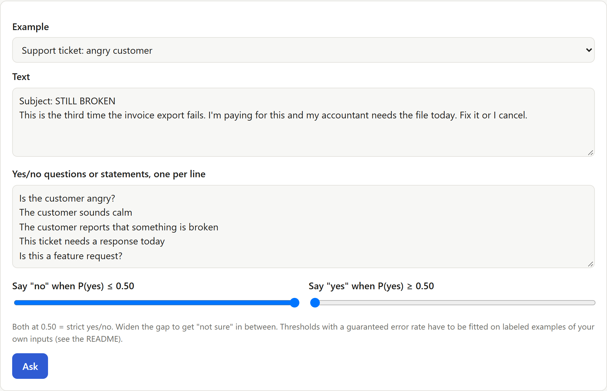
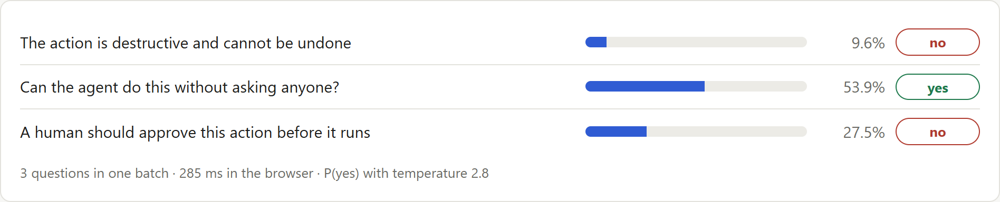
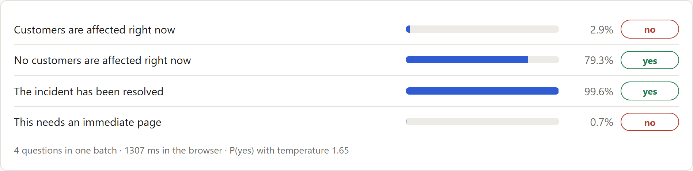
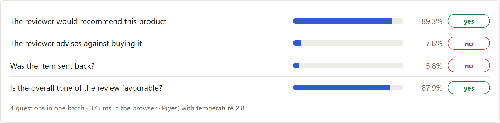

# Maya: Open-Source Yes/No AI Guardrail Model (Runs in Browser)


*Every answer is yes, no, or something in between.*

**Maya is an open-source yes/no AI guardrail model.** You give it a text and a statement ("this change can be undone", "is the customer angry?") and it returns the probability that the answer is yes. It is built for the binary checks that LLM agents and AI applications run constantly: should this action go ahead, does this ticket need a person, is this message a scam.

Maya belongs to the same family as the decision models **Jev** and **Laya**, is built on an **NLI encoder**, and does a job close to that of **LLM guard** models such as Llama Guard. This article explains each of those, shows how Maya differs, and reports its benchmark results.

**Key takeaways**
- Maya answers any yes/no question about a text and returns a probability, not generated text.
- On hand-labeled tests it scores 87.5% on judgment questions and 95.3% on unseen domains, ahead of Laya and of the best zero-shot NLI model.
- It contradicts itself far less: 12% of statement/negation pairs get the same answer, where its zero-shot starting point is at 73%.
- It is open source and runs fully in the browser with ONNX Runtime Web, so no text leaves the device.

Accuracy on three hand-labeled test sets that were never used for training:

| Test set | Laya | Best zero-shot NLI model | **Maya** |
|---|---|---|---|
| Judgment questions (192 answers) | 62.5% | 72.9% | **87.5%** |
| Eight unseen domains (256 answers) | 80.1% | 89.8% | **95.3%** |
| Familiar domains (120 answers) | 68.3% | 75.8% | **87.5%** |

- **Try it in your browser: [vishalmysore.github.io/maya](https://vishalmysore.github.io/maya/)**
- Code, data, tests and every result: [github.com/vishalmysore/maya](https://github.com/vishalmysore/maya)
- Model weights: [huggingface.co/VishalMysore/maya](https://huggingface.co/VishalMysore/maya)
- Browser build: [huggingface.co/VishalMysore/mayaWasm](https://huggingface.co/VishalMysore/mayaWasm)


## Contents

1. [What is Jev? TypeSafe's System One decision model](#what-is-jev-typesafes-system-one-decision-model)
2. [What is Laya? An open decision model](#what-is-laya-an-open-decision-model)
3. [What is Maya? A dedicated yes/no AI guardrail model](#what-is-maya-a-dedicated-yesno-ai-guardrail-model)
4. [What are NLI encoders? Natural language inference explained](#what-are-nli-encoders-natural-language-inference-explained)
5. [What are LLM guards? Llama Guard, ShieldGemma and Prompt Guard](#what-are-llm-guards-llama-guard-shieldgemma-and-prompt-guard)
6. [How is Maya different from Jev, Laya, NLI models and LLM guards?](#how-is-maya-different-from-jev-laya-nli-models-and-llm-guards)
7. [How Maya works](#how-maya-works)
8. [How Maya was built: training data and fine-tuning](#how-maya-was-built-training-data-and-fine-tuning)
9. [How Maya was tested](#how-maya-was-tested)
10. [Results: Maya benchmark accuracy](#results-maya-benchmark-accuracy)
11. [Maya in action: guardrail examples](#maya-in-action-guardrail-examples)
12. [Yes, no, or not sure: abstention](#yes-no-or-not-sure-abstention)
13. [Running Maya in the browser with ONNX Runtime Web](#running-maya-in-the-browser-with-onnx-runtime-web)
14. [Limitations](#limitations)
15. [Frequently asked questions](#frequently-asked-questions)

## What is Jev? TypeSafe's System One decision model

Jev is a hosted **decision model** from TypeSafe AI, launched in September 2026. TypeSafe calls it a "System One" model, after Daniel Kahneman's term for fast, intuitive judgment.

**What it does.** Jev never writes text. You send it a *state* (any text or structured data) and one or more *typed questions*, and it returns one typed answer per question, each with a probability:

| Question type | What it answers | What comes back |
|---|---|---|
| **Choice** | Pick one label from a list | a probability per option |
| **Score** | Place the text on an ordered scale | a probability per level |
| **Noul** | A yes/no condition | one probability that it is true |

**Why people use it.** An LLM answers "route this ticket" by writing text that your code then has to parse and validate. A decision model returns a value inside the schema you defined, in one pass, with a confidence your code can act on: do it automatically above a threshold, send it to a person below.

**Availability.** Jev's weights are closed and it is reached through an API. It was not benchmarked in this project; what is said about it here is its public description.

## What is Laya? An open decision model

[Laya](https://huggingface.co/convaiinnovations/laya-typed-decisions) is an **open** decision model from ConvAI Innovations that follows the same design: a state plus typed questions (choice, score, yes/no) in, probabilities out.

- **Architecture:** a ModernBERT-large encoder (395M parameters) with a small decision head (26.5M), 421M in total.
- **Why it matters here:** because the weights are open, Laya can be measured, taken apart and run in a browser. It is the decision-model baseline in this article.
- **layaMOE:** an earlier project of mine, [layaMOE](https://github.com/vishalmysore/layaMOE), adds domain-expert heads and a router on top of Laya's frozen encoder.

Laya answers all three question types from one encoder pass.

## What is Maya? A dedicated yes/no AI guardrail model

Maya takes one of those three question types, **yes/no**, and gives it a dedicated model.

- **Input:** a text and a statement, or a yes/no question.
- **Output:** P(yes), and from it the answer "yes" or "no". If you set a band, a third answer, "not sure", appears between two thresholds.
- **Size:** 435M parameters, fine-tuned from DeBERTa-v3-large-zeroshot-v2.0. It runs in Python on a CPU, and as a 600 MB int8 ONNX model in the browser.
- **Open:** code, data, tests, results and weights are public.

**Why a dedicated yes/no model:**
- Yes/no is the question type that guardrails and early-exit filters use most.
- A single probability is the easiest output to calibrate.
- "X" and "not X" should never both be true, and that can be tested and trained for.

## What are NLI encoders? Natural language inference explained

**Natural language inference (NLI)** is the task of deciding whether one sentence follows from another. Given a *premise* ("The parcel arrived smashed") and a *hypothesis* ("The item was damaged"), an NLI model labels the pair as entailment, contradiction or neutral.

- **Encoders.** NLI models are usually encoders such as BERT, DeBERTa or ModernBERT. They read text and produce a classification; they do not generate text.
- **Cross-encoders.** The premise and hypothesis go through the model together as one sequence, so every word of one can attend to every word of the other. This is accurate, but it costs one model pass per pair.
- **Zero-shot classification.** An NLI model can answer questions it was never trained on: put the text in as the premise and your statement in as the hypothesis, and read the entailment probability as "yes". Models such as the `zeroshot-v2.0` DeBERTa family are fine-tuned on many datasets for exactly this.

**Their limit.** An NLI model asks whether the text *literally supports* the statement. That works for facts ("pets are allowed"). It is weaker on judgment ("the customer is angry", "a person should approve this"), which a text rarely states outright. In the results below, zero-shot NLI models often say "no" to both a statement and its negation.

Maya is built on an NLI encoder and keeps its strength on facts, then adds the judgment reading through fine-tuning.

## What are LLM guards? Llama Guard, ShieldGemma and Prompt Guard

**LLM guards** are models that sit next to a large language model and check what goes in or comes out. Well-known examples are Llama Guard and Prompt Guard from Meta and ShieldGemma from Google.

- **What they check.** Mostly a fixed list of safety categories: violence, hate, self-harm, sexual content, and for Prompt Guard, prompt injection and jailbreak attempts.
- **How they are built.** Some are LLMs fine-tuned to output "safe" or "unsafe" plus a category. Others are small encoder classifiers with a fixed set of labels.
- **What they are good at.** Content safety against a published policy, at scale.

**Where Maya fits.** A guard answers the questions it was trained for. It does not answer "can this database change be undone?", "does this invoice match the quote?" or "is this customer about to cancel?". Those are application-specific yes/no questions, and they are the ones Maya is for. Maya complements a content-safety guard; it does not replace one.

## How is Maya different from Jev, Laya, NLI models and LLM guards?

| | Jev | Laya | Zero-shot NLI encoder | LLM guard | **Maya** |
|---|---|---|---|---|---|
| Weights | closed, API | open | open | mostly open | open |
| Question types | choice, score, yes/no | choice, score, yes/no | any statement | fixed safety categories | **yes/no only**, any statement |
| Reads judgment ("is this risky?") | by design | by design | weak, reads literally | only its own categories | **trained for it** |
| Generates text | no | no | no | some do | no |
| Runs in a browser tab | no | yes | yes | small ones | yes |
| Tested here | no | yes | yes | no | yes |

In practice:

- **Versus Jev and Laya:** the same idea of typed decisions without text generation, narrowed to yes/no. Maya gives up choice and score questions. In return it is more accurate on yes/no than Laya on every test set here, and far more consistent.
- **Versus zero-shot NLI:** the same kind of model, and Maya starts from one. The difference is judgment. On judgment questions, fine-tuning lifts the same DeBERTa model from 72.9% to 87.5%, and cuts self-contradictions from 73% to 12%.
- **Versus LLM guards:** open statements, not a fixed list. You write the question at request time.

## How Maya works

Maya is a **cross-encoder**. The text and the statement go through the model together, `[CLS] text [SEP] statement [SEP]`, and the classifier head produces two logits:

```
P(yes) = sigmoid((logit_yes - logit_no) / temperature)
```

**It can only answer yes or no.** There is no text generator, so it cannot ramble or produce a third label by accident. It also cannot refuse: a question that is not yes/no ("what colour is it?") still gets a probability, so only ask yes/no questions.

Statements can be claims ("The customer sounds angry") or questions ("Is the customer angry?").

```python
from maya.gate import Maya

maya = Maya.load("VishalMysore/maya")
maya.ask("Agent plan: delete the `sessions` table on the production database. A verified backup was "
         "taken ten minutes ago and the on-call engineer has reviewed the plan.",
         ["The action is destructive and cannot be undone", "This action can be undone if needed"])
# no (0.15), yes (0.90)
```


## How Maya was built: training data and fine-tuning

### The base model

Maya starts from **DeBERTa-v3-large-zeroshot-v2.0**, the strongest off-the-shelf NLI model in our tests on unseen domains (89.8%).

### The training data

The data is generated by rules, so every label is correct by construction: 5,687 texts and 25,717 statements, half of them "yes". It is designed so that keywords alone cannot solve it.

**Agent actions**
- Many openers, actions and scopes.
- Safety nets written a dozen ways ("a snapshot was made", "we can restore from the hourly dump", "it is a soft delete"), present in about two thirds of destructive plans.
- Negated safety nets too: "the backup job has been failing for a week".

**Customer messages**
- Anger through capitals, sarcasm ("Brilliant work, truly"), polite-but-firm wording, and blunt or weary styles.
- Calm messages that still report a problem, so "problem" does not mean "angry".
- Six contexts, from software to gym memberships.

**Other domains**
- Content moderation, support tickets, deliveries, email triage, IT incidents, product reviews, expense claims, meeting requests, code changes, insurance claims and sales inquiries.

**Pairs and traps**
- Every fact has plain wordings and negated wordings with opposite labels. This is what teaches the model that "X" and "not X" cannot both be true.
- About 40% of the agent and customer texts have a **minimal-pair partner** that differs only in the deciding detail: the safety net, the review, the scope or the mood.
- **Word-overlap traps** reuse a statement's words with the opposite meaning: "No human has checked this step" and "No approval is needed for this under the runbook".

**Anchors**
- Real yes/no questions from BoolQ and NLI pairs from MNLI are mixed into every training step, so the model keeps its general reading skill.

### Training

- 468 steps on a laptop CPU, about 2.5 hours, with frozen embeddings.
- The checkpoint was chosen on a separate 64-answer dev set, not on the test sets.
- One practical note: load these models in float32 on CPU. The bfloat16 default makes CPU training about 100 times slower.

## How Maya was tested

Accuracy alone flatters yes/no models: on one of these sets, answering "no" to everything scores 62.5%. So every model is measured on three hand-labeled sets and on more than accuracy.

| Set | Answers | What it is |
|---|---|---|
| **Judgment** | 192 | judgment questions in 8 domains, written and committed before the training data; 6 of the domains never appear in training |
| **Unseen domains** | 256 | 8 domains never used in training: rental listings, travel notices, school messages, contract clauses, scam messages, smart-home commands, recipes, job postings |
| **Familiar domains** | 120 | 8 domains, mostly kinds of text Maya trains on |

Every case in the first two sets has built-in checks:

| Check | Example | What a good model does |
|---|---|---|
| Negation pair | "The traveler needs to take action" / "The traveler does not need to do anything" | gives opposite answers |
| Implication pair | "Dogs are allowed" => "Pets are allowed" | never says yes to the first and no to the second |
| Minimal pair | the same recipe with "crushed peanuts" or "toasted sesame seeds" | flips the answer to "safe for a peanut allergy" |
| Word-overlap trap | "I'm not angry, just curious: is there a keyboard shortcut?" | is not fooled by the word "angry" |

**Leakage guards.** Unit tests check both rules:
- No training text shares a five-word sequence with any test text.
- No training statement equals a statement from the judgment or unseen-domain sets.

## Results: Maya benchmark accuracy


| Model | Params | Judgment | Unseen domains | Familiar domains |
|---|---|---|---|---|
| always "no" | | 43.2% | 50.8% | 62.5% |
| laya-typed-decisions | 421M | 62.5% | 80.1% | 68.3% |
| layaMOE | 421M + heads | 63.5% | 78.5% | 78.3% |
| ModernBERT-base zero-shot | 150M | 66.7% | 78.5% | 76.7% |
| DeBERTa-v3-base zero-shot | 184M | 66.7% | 81.2% | 70.8% |
| DeBERTa-v3-large zero-shot (Maya's starting point) | 435M | 72.9% | 89.8% | 75.8% |
| **Maya** | 435M | **87.5%** | **95.3%** | **87.5%** |

Fine-tuning adds 14.6 points on judgment questions and 5.5 points on unseen domains over the same model used zero-shot.

**Consistency.** Maya gives the same answer to a statement and its negation on 12% of judgment pairs and 8% of unseen-domain pairs. Its zero-shot starting point does so on 73% and 30%.


**Minimal pairs.** Both texts of a pair are right 71% of the time on the judgment set and 91% on unseen domains. The zero-shot starting point manages 33% and 78%.


**Traps.** On the 10 word-overlap trap cases, 90% of Maya's answers are right.

**Calibration.** With one temperature (1.65) fitted on the dev set, calibration error (ECE) is 0.064 on the judgment set and 0.025 on unseen domains.

**Speed.** On a laptop CPU in Python, one question takes about 0.55 s and twenty questions about one text take 4.4 s.

## Maya in action: guardrail examples

All of these are from the live demo.

**An angry customer**




**An agent plan with a safety net.** The plan deletes a production table, but a verified backup exists, so Maya says it can be undone:


**A read-only query**



**A resolved incident**



**A product review**



## Yes, no, or not sure: abstention

By default Maya answers strictly yes or no, at a threshold of 0.5.

You can also set a **band**. Answers above the upper threshold are "yes", answers below the lower one are "no", and anything in between is "not sure". This lets a guardrail hold back when the model is uncertain and send the case to a person.


In the demo you set the band by hand with two sliders. For a band with a **guaranteed error rate**, the repository includes a module (`maya/conformal.py`) that fits the two thresholds on labeled examples of your own inputs, so that among the questions Maya answers, the error stays under a target you choose. It needs a few hundred labeled examples to certify a tight bound.

## Running Maya in the browser with ONNX Runtime Web

**The build**
- One ONNX graph with **int8 weight-only quantization**, about 600 MB, split into 24 MiB parts with SHA-256 hashes.
- Checked against PyTorch on 256 answers: 94.9% accuracy against 95.3%, with one answer flipping.

**In the browser**
- The [demo](https://vishalmysore.github.io/maya/) uses **ONNX Runtime Web** (WebAssembly, 4 threads when the page is cross-origin isolated) and the Hugging Face `tokenizers` JavaScript library.
- The first visit downloads the model from Hugging Face in about a minute. After that it loads from the browser cache.
- Five questions about one text take about 1.8 s. No text leaves the device.
- On 33 test items the JavaScript tokenizer gives the same token ids as Python, and probabilities differ from PyTorch by at most 0.03.


**Testing.** The repository has 35 automated tests. They cover the test sets' labels, the metrics, the training-data rules and leakage checks, and the model itself: its answers are only ever yes, no or not sure, batched and single answers agree, and the int8 build matches PyTorch.

## Limitations

- **It is not always right.** About one in eight answers on judgment questions is wrong. Use Maya as one signal next to rules and human review, not as the only safety check.
- **Some domains are weaker.** IT incidents, smart-home commands, access requests and account security score 67-81%, and some questions about code changes are answered wrongly.

  

- **The test sets are small.** One answer on the judgment set is half a point, and differences under about 5 points are not reliable.
- **Size and speed.** The browser model is a 600 MB download, and each question is one pass through a 435M-parameter model.
- **Yes/no only, English only.** It cannot refuse a question that is not yes/no.
- **Commercial use.** Maya's code and weights are released under Apache-2.0, but the base model's card says its non-"-c" versions were trained on data that includes non-commercially licensed datasets. Check before commercial use.

## Frequently asked questions

**What is Maya?**
Maya is an open yes/no classifier. Given a text and a statement or yes/no question, it returns the probability that the answer is yes. It is a 435M-parameter fine-tune of DeBERTa-v3-large-zeroshot-v2.0.

**What is the difference between Maya, Jev and Laya?**
Jev (hosted, closed) and Laya (open) are decision models that answer three question types: choice, score and yes/no. Maya answers only yes/no. It is open like Laya, and on the yes/no test sets here it is more accurate than Laya and contradicts itself far less. Jev was not tested.

**How is Maya different from an NLI model?**
Maya is an NLI encoder that has been fine-tuned to make judgments. A zero-shot NLI model answers whether a text literally supports a statement, so it is weaker on judgment questions. Starting from the same DeBERTa model, fine-tuning lifts accuracy on judgment questions from 72.9% to 87.5%.

**How is Maya different from Llama Guard or ShieldGemma?**
Those guards check content against a fixed list of safety categories. Maya answers any yes/no statement you write at request time, such as "can this change be undone?". It complements a content-safety guard.

**How accurate is Maya?**
On hand-labeled test sets never used for training: 87.5% on judgment questions, 95.3% on eight unseen domains and 87.5% on familiar domains.

**Can Maya give answers other than yes or no?**
By default, no. If you set a band, answers between the two thresholds are shown as "not sure".

**Does it run in the browser?**
Yes. The int8 ONNX build (about 600 MB, cached after the first visit) runs with ONNX Runtime Web and WebAssembly at [vishalmysore.github.io/maya](https://vishalmysore.github.io/maya/). No text leaves your device.

**Can I use Maya as an AI agent guardrail?**
As one signal. It is right about 88% of the time on agent-action judgment cases, so combine it with rules and human review.

**Is it open source?**
Yes. Code, data, tests and results are at [github.com/vishalmysore/maya](https://github.com/vishalmysore/maya), with weights at [VishalMysore/maya](https://huggingface.co/VishalMysore/maya) and [VishalMysore/mayaWasm](https://huggingface.co/VishalMysore/mayaWasm).

---

*Maya is an unofficial experiment. It is not affiliated with TypeSafe AI (Jev), ConvAI Innovations (Laya), Microsoft (DeBERTa), Meta (Llama Guard, Prompt Guard), Google (ShieldGemma), or the authors of the NLI models it builds on and is compared against.*
