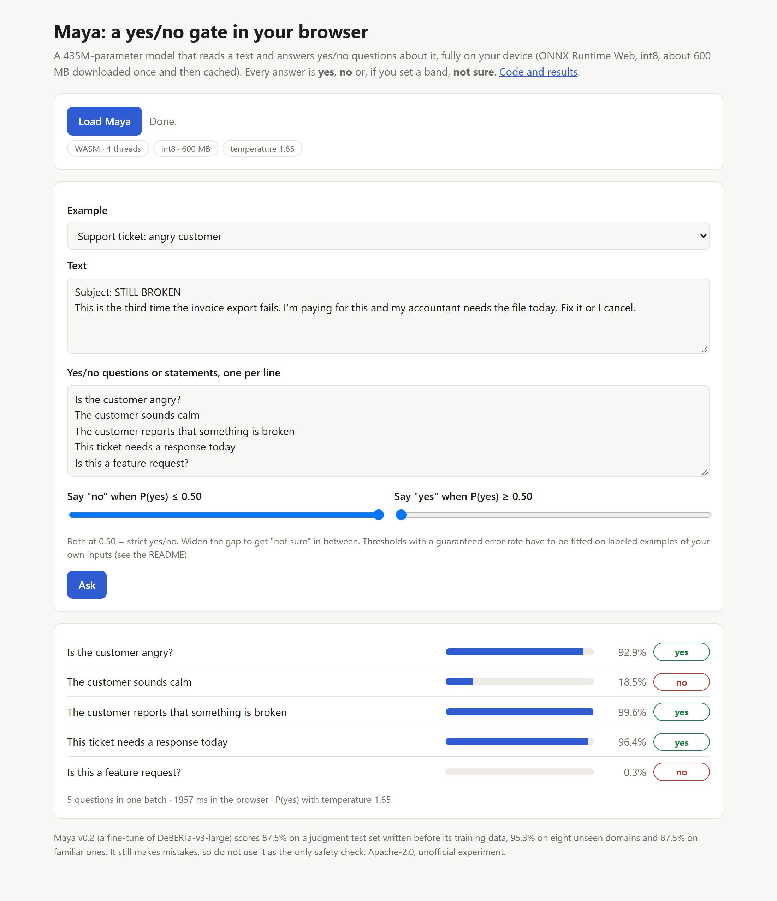
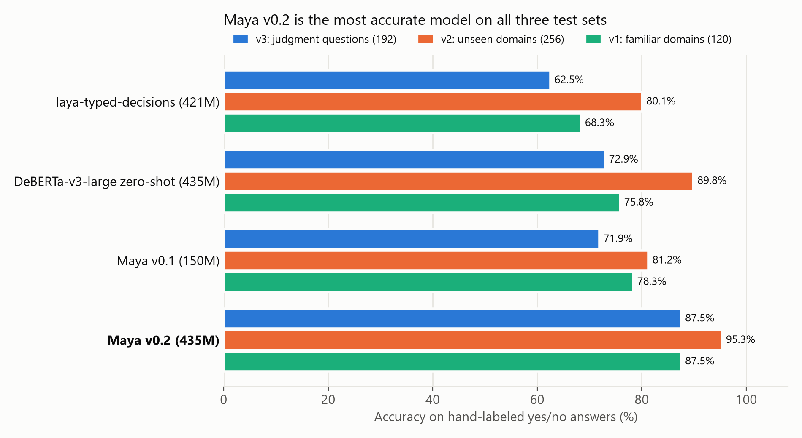
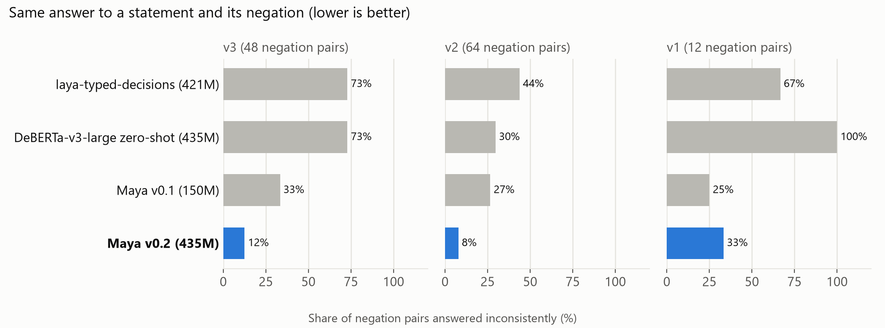
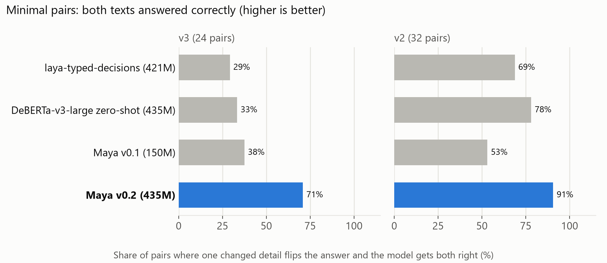
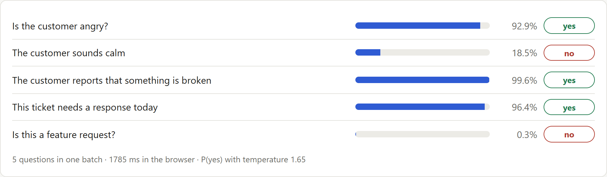
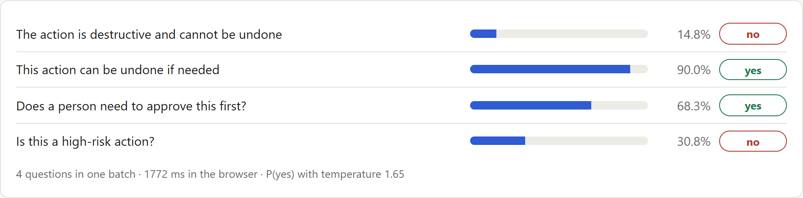
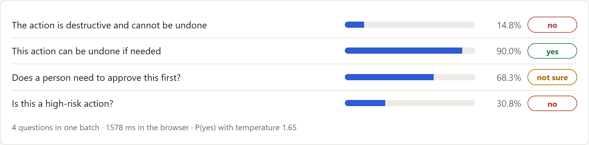
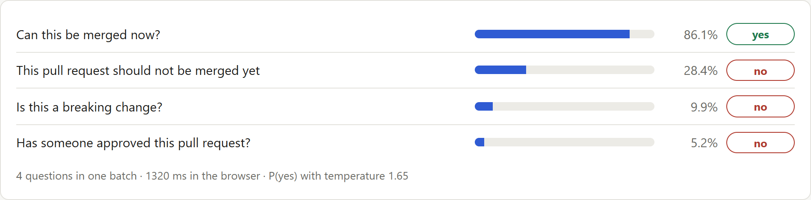
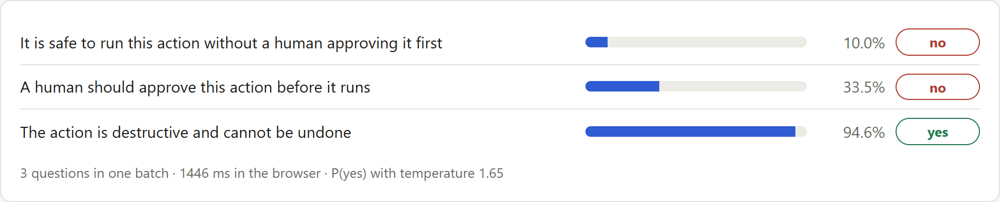
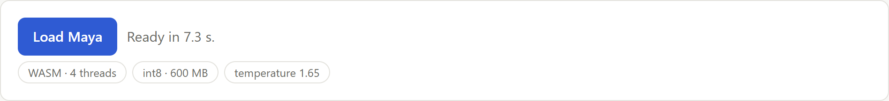

# Fixing a Yes/No AI Guardrail Model: How Maya v0.2 Went from 72% to 88% on Judgment Questions

**TL;DR:** Maya is a **yes/no classifier** for AI guardrails. You give it a text and a statement ("this change can be undone", "is the customer angry?") and it returns the probability that the answer is yes. Version 0.1 looked fine on its benchmarks and then failed in its own demo. Version 0.2 fixes the cause.

Accuracy on three hand-labeled test sets:

| Test set | Maya v0.1 | Best other model | **Maya v0.2** |
|---|---|---|---|
| Judgment questions, written before the new training data (192 answers) | 71.9% | 72.9% | **87.5%** |
| Eight unseen domains (256 answers) | 81.2% | 89.8% | **95.3%** |
| Familiar domains (120 answers) | 78.3% | 78.3% | **87.5%** |

The model is still wrong about one time in eight on judgment questions, and this article shows where.

- **Try it in your browser: [vishalmysore.github.io/maya](https://vishalmysore.github.io/maya/)**
- Code, data, tests and every result: [github.com/vishalmysore/maya](https://github.com/vishalmysore/maya)
- Model weights: [huggingface.co/VishalMysore/maya](https://huggingface.co/VishalMysore/maya)
- Browser build: [huggingface.co/VishalMysore/mayaWasm](https://huggingface.co/VishalMysore/mayaWasm)



## Contents

1. [What Maya is](#what-maya-is)
2. [The failure: good benchmarks, wrong answers](#the-failure-good-benchmarks-wrong-answers)
3. [Diagnosis: template overfitting and literal reading](#diagnosis-template-overfitting-and-literal-reading)
4. [Step 1: write the test before the fix](#step-1-write-the-test-before-the-fix)
5. [Step 2: rebuild the training data](#step-2-rebuild-the-training-data)
6. [Step 3: a stronger base model](#step-3-a-stronger-base-model)
7. [Results](#results)
8. [Choosing the model without peeking](#choosing-the-model-without-peeking)
9. [Where Maya v0.2 is still wrong](#where-maya-v02-is-still-wrong)
10. [Running a 435M-parameter model in the browser](#running-a-435m-parameter-model-in-the-browser)
11. [Testing](#testing)
12. [Lessons learned](#lessons-learned)
13. [FAQ](#faq)

## What Maya is

Many decisions in an AI system are binary:
- Should an agent run this command without asking a person?
- Is this customer angry?
- Can this change be undone?

Maya is a small model that does only this. It is a **cross-encoder**: the text and the statement go through the model together, and a classifier head produces a probability.

```
P(yes) = sigmoid((logit_yes - logit_no) / temperature)
```

Because it has one output, **Maya can only answer yes or no**, plus "not sure" if you set an abstention band. It cannot generate text, and it cannot refuse a question, so only ask yes/no questions.

```python
from maya.gate import Maya

maya = Maya.load("VishalMysore/maya")
maya.ask("Agent plan: delete the `sessions` table on the production database. A verified backup was "
         "taken ten minutes ago and the on-call engineer has reviewed the plan.",
         ["The action is destructive and cannot be undone", "This action can be undone if needed"])
# no (0.15), yes (0.90)
```

## The failure: good benchmarks, wrong answers

Maya v0.1 was a 150M-parameter ModernBERT model fine-tuned on rule-labeled synthetic data. On its test sets it scored 78.3% on familiar domains and 81.2% on unseen ones, with far fewer self-contradictions than any other model we tested. The [v0.1 article](article-v0.1.md) has those details.

Then we tried it in the browser demo:

| Text | Question | Correct | Maya v0.1 |
|---|---|---|---|
| "STILL BROKEN. Third time the export fails. I'm paying for this. Fix it or I cancel." | Is the customer angry? | yes | **no** (0.23) |
| Same ticket | The customer sounds calm | no | **yes** (0.72) |
| "Delete the sessions table on production. A verified backup was taken ten minutes ago." | The action is destructive and cannot be undone | no | **yes** (0.75) |
| "Run DELETE on production. No backup, and no human has reviewed this." | It is safe to run without a human approving it | no | **yes** (0.92) |
| A real phishing text asking for a bank code | This message is a scam | yes | **no** (0.00) |

## Diagnosis: template overfitting and literal reading

Three experiments explained these failures.

**1. Maya had learned phrases, not concepts.** The angry ticket scored 0.23 for "angry". The same complaint with the word "Unacceptable" or "furious" scored above 0.90. Those were the words the training generator used for anger.

**2. Rare cases lost to common shortcuts.** In the backup example, Maya noticed the backup for one statement: "can be undone" moved from 0.04 to 0.89. But "destructive" stayed at 0.84-0.96 for any delete on production. In the training data, only 22 of 20,429 statements covered a destructive action with a backup, so thousands of other examples taught the shortcut "delete on production means destructive".

**3. Off-the-shelf models fail the opposite way.** We ran the same examples through untouched zero-shot NLI models. They said "no" to almost everything. An NLI model asks whether the text literally states the claim. "The customer is angry" is never literally stated, so the answer is no, and so is the answer to "the customer is calm". That is why zero-shot models contradict themselves on most negation pairs.

So the two kinds of model need different things:
- A **zero-shot NLI model** reads literally. It is strong on factual statements and weak on judgment.
- **Maya v0.1** made judgments, but from keywords.

The fix had to teach judgment from data that could not be solved by keywords.

## Step 1: write the test before the fix

By this point the existing test sets had been studied closely, so they could no longer give a clean verdict. Before writing any new training data, we wrote and committed a new test set, v3.

**What v3 contains:**
- 192 answers in 8 domains.
- Two domains are familiar kinds of text with new wording: agent actions and customer tone.
- Six domains never appear in training: access requests, refunds, account security, contractor invoices, leave requests, landlord notices.
- Every question needs judgment: "this invoice can be paid now", "the account may be compromised".

**What makes it hard to game:**
- **Word-overlap traps** (10 cases): "I'm not angry, just curious: is there a keyboard shortcut for archiving?"
- **Minimal pairs:** the same text with one detail changed, which flips the answer.
- A hand-written **negation** and an **implication** pair for every case.

A separate dev set of 64 answers, in the same domains but with different cases, is used only to choose the checkpoint and fit the temperature.

The existing models found v3 hard: Laya 62.5%, zero-shot DeBERTa-v3-large 72.9%, Maya v0.1 71.9%. No model got more than 38% of the minimal pairs fully right.

## Step 2: rebuild the training data

The labels still come from rules, so they are correct by construction. What changed is the text.

**Agent actions**
- Many openers, actions and scopes.
- Safety nets written a dozen ways ("a snapshot was made", "we can restore from the hourly dump", "it is a soft delete"), present in about two thirds of destructive plans.
- Negated safety nets too: "the backup job has been failing for a week".

**Customer messages**
- Anger through capitals, sarcasm ("Brilliant work, truly"), polite-but-firm wording, and blunt or weary styles.
- Calm messages that still report a problem, so "problem" does not mean "angry".
- Seven contexts, from software to gym memberships.

**Traps and pairs**
- Texts that reuse a statement's words with the opposite meaning: "No human has checked this step" versus "No approval is needed for this under the runbook".
- About 40% of the new texts have a **minimal-pair partner** that differs only in the deciding detail: the safety net, the review, the scope, or the mood.

**Anchors**
- Real yes/no questions from BoolQ and NLI pairs from MNLI are mixed into every training step, so the model keeps its general reading skill.

The result is 5,687 texts and 25,717 statements, half of them "yes".

**Leakage guards.** Unit tests check both rules:
- No training text shares a five-word sequence with any test or dev text.
- No training statement equals a v2, v3 or dev statement.

## Step 3: a stronger base model

In the v0.1 evaluation, untouched **DeBERTa-v3-large-zeroshot-v2.0** was the best model on unseen domains (89.8%), so v0.2 starts from it instead of ModernBERT-base.

We fine-tuned two candidates on a laptop CPU:
- **DeBERTa-v3-base:** one epoch, about 2 hours.
- **DeBERTa-v3-large:** 468 steps, about 2.5 hours, with frozen embeddings.

Both use checkpoint selection on the dev set. One practical note: load these models in float32 on CPU. The bfloat16 default made training about 100 times slower.

## Results



| Model | Params | v3: judgment | v2: unseen domains | v1: familiar |
|---|---|---|---|---|
| laya-typed-decisions | 421M | 62.5% | 80.1% | 68.3% |
| DeBERTa-v3-large zero-shot (starting point) | 435M | 72.9% | 89.8% | 75.8% |
| Maya v0.1 | 150M | 71.9% | 81.2% | 78.3% |
| **Maya v0.2** | 435M | **87.5%** | **95.3%** | **87.5%** |

Fine-tuning added 14.6 points on judgment questions and 5.5 points on unseen domains over the same model used zero-shot. On v2, v0.2 now beats the off-the-shelf model that v0.1 lost to.

**Consistency.** Maya v0.2 gives the same answer to a statement and its negation on 12% of v3 pairs and 8% of v2 pairs. The zero-shot starting point does so on 73% and 30%.



**Minimal pairs.** Both texts of a pair are right 71% of the time on v3 (best earlier model: 38%) and 91% on v2 (best earlier: 78%).



**Traps.** On the 10 word-overlap trap cases, 90% of v0.2's answers are right.

**Calibration.** With one temperature (1.65) fitted on the dev set, calibration error is 0.064 on v3 and 0.025 on v2.

**The demo failures.** The examples from the table above now come out right:





## Choosing the model without peeking

We had three candidates and decided in advance to choose on the dev set:

| Candidate | Dev (64 answers) | v3 | v2 | v1 |
|---|---|---|---|---|
| DeBERTa-v3-base fine-tune | 78.1% | 83.3% | 87.1% | 91.7% |
| **DeBERTa-v3-large fine-tune (shipped)** | **87.5%** | 87.5% | 95.3% | 87.5% |
| Ensemble of both | 85.9% | 88.5% | 93.0% | 93.3% |

The large model won on dev by one answer. Across all three test sets the ensemble is 3 answers better out of 568, which is a tie. We shipped the single model.

Two other findings from this step:
- **Asking each question both ways** (combining the statement and its negation) helped the zero-shot models, but it made v0.2 worse on dev. We left it out.
- **A bounded-error "not sure" band could not be certified** from 64 dev answers, even at a 20% error target. Maya ships with strict yes/no, and the demo's sliders set a band by hand, without a guarantee.



## Where Maya v0.2 is still wrong

The demo found v0.1's failures, so we looked for v0.2's the same way.

**Code changes got worse.** For a pull request that drops a database column and has not been reviewed, v0.2 says it can be merged and is not a breaking change. Both are wrong, and v0.1 got them right. The v0.2 training mix has only 90 code-change texts, because the budget went to agent actions and tone. The smaller base candidate handles this example, and that is part of why the ensemble is steadier on familiar domains.



**One v0.1 failure is only half fixed.** For the production `DELETE` that "no human has reviewed", v0.2 correctly says it is not safe to run without a human. It still answers "no" to "A human should approve this action before it runs".



**Weaker domains:**
- IT incidents (67%) and patient messages (75%) on v1.
- Smart-home commands (81%) on v2.
- Access requests, account security and leave requests (75-79%) on v3.

**Overall:**
- About one in eight judgment answers is wrong (24 of 192 on v3).
- The test sets are small. One answer on v3 is half a point, and differences under about 5 points are not reliable.

**Do not use Maya as the only safety check.**

## Running a 435M-parameter model in the browser

**The build**
- One ONNX graph with **int8 weight-only quantization**, about 600 MB, split into 24 MiB parts with SHA-256 hashes.
- Checked against PyTorch on 256 answers: 94.9% accuracy against 95.3%, with one answer flipping.

**In the browser**
- The [demo](https://vishalmysore.github.io/maya/) uses **ONNX Runtime Web** (WebAssembly, 4 threads when the page is cross-origin isolated) and the Hugging Face `tokenizers` JavaScript library.
- The first visit downloads the model from Hugging Face in about a minute. After that it loads from the browser cache, which is much faster.
- Five questions about one text take about 1.8 s. No text leaves the device.
- On 33 test items the JavaScript tokenizer gives the same token ids as Python, and probabilities differ from PyTorch by at most 0.03.



**The cost of accuracy.** v0.2 is about four times larger than v0.1 in the browser (600 MB against 161 MB). On a laptop CPU in Python it takes 0.55 s per question, where v0.1 took 0.10 s.

## Testing

**35 automated tests, all passing:**
- **Test sets:** every negation pair has opposite labels, every implication holds, and every minimal pair flips its key answer (v2, v3 and dev).
- **Metrics and abstention:** including a simulation that the abstention guarantee holds on in-distribution data.
- **Generators:** rules hold on thousands of samples, and nothing leaks from any test or dev set into the training data.
- **Model:**
  - the answers are only ever yes, no or not sure;
  - batched and single answers agree;
  - the published model reproduces the recorded test probabilities;
  - two v0.1 failures stay fixed;
  - the int8 ONNX graph matches PyTorch.

**Live check:** after deployment, a headless browser loaded the model from Hugging Face on the public page and reproduced the expected answers.

## Lessons learned

1. **Try the demo before trusting the benchmark.** v0.1's main flaw took five minutes of clicking to find and was invisible in its test scores. v0.2's code-change regression was found the same way.
2. **Write the test set before the fix, and commit it.** Once you have studied a test set's errors, it can no longer judge the fix.
3. **Rule-labeled data needs variety, not volume.** v0.1 had 20,000 statements and learned keywords. Varied phrasings, minimal pairs and overlap traps taught the concept.
4. **Zero-shot NLI reads literally.** It is strong on facts and weak on judgment, and it contradicts itself. Fine-tuning for judgment fixed both problems without losing the strength on unseen domains.
5. **Rebalancing has a price.** Moving the data budget to guardrails and tone cost accuracy on code changes. Each domain you care about needs enough examples.
6. **Choose on a dev set you never report as a result,** and report the alternatives you did not choose.

**What's next:**
- Restore the code-change and IT-incident coverage.
- Label a few hundred real inputs so the "not sure" band can carry a real guarantee.
- Test whether a distilled smaller model can keep most of this accuracy.

## FAQ

**What is Maya?**
Maya is a yes/no classifier. Given a text and a statement or yes/no question, it returns the probability that the answer is yes. Version 0.2 is a 435M-parameter fine-tune of DeBERTa-v3-large-zeroshot-v2.0.

**How accurate is Maya v0.2?**
On hand-labeled test sets that were never used for training: 87.5% on judgment questions (v3), 95.3% on eight unseen domains (v2) and 87.5% on familiar domains (v1). The off-the-shelf model it starts from scores 72.9%, 89.8% and 75.8%.

**What was wrong with Maya v0.1?**
It overfit to the phrases of its synthetic training data. It recognized anger only through words like "unacceptable", and it treated any delete on production as irreversible, even with a backup.

**How was it fixed?**
With new training data that has many phrasings per situation, minimal pairs that differ only in the deciding detail, and texts that reuse a statement's words with the opposite meaning. v0.2 also starts from a stronger base model. A new test set was written before the new training data.

**Can Maya give answers other than yes or no?**
No. It is a classifier with one probability output. "Not sure" appears only if you set abstention thresholds.

**Does it run in the browser?**
Yes. The int8 ONNX build (about 600 MB, cached after the first visit) runs with ONNX Runtime Web and WebAssembly at [vishalmysore.github.io/maya](https://vishalmysore.github.io/maya/). No text leaves your device.

**Can I use Maya as an AI agent guardrail?**
Only as one signal. It is right about 88% of the time on agent-action judgment cases and still makes clear mistakes, so combine it with rules and human review.

**Is Maya better than zero-shot NLI models like DeBERTa?**
On every test set here, yes, including the unseen domains where zero-shot DeBERTa-v3-large beat Maya v0.1. It also contradicts itself far less often.

**Can I use it commercially?**
Check first. Maya's code and weights are released under Apache-2.0, but the base model's card says its non-"-c" versions were trained on data that includes non-commercially licensed datasets.

**Where is the old model?**
Maya v0.1 is kept under the `v0.1` tag of both Hugging Face repositories, and its write-up is in [article-v0.1.md](article-v0.1.md).

---

*Maya is an unofficial experiment and is not affiliated with ConvAI Innovations (Laya), Microsoft (DeBERTa), or the authors of the NLI models it builds on and is compared against.*
